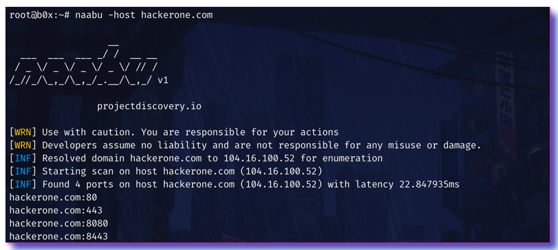

<h1 align="left">
  </a>
  <br>
</h1>


[](https://opensource.org/licenses/MIT)
[](https://goreportcard.com/report/github.com/projectdiscovery/naabu)
[](https://github.com/projectdiscovery/naabu/issues)
[](https://github.com/projectdiscovery/naabu/releases)
[](https://twitter.com/pdiscoveryio)
[](https://hub.docker.com/r/projectdiscovery/naabu)
[](https://discord.gg/KECAGdH)

Naabu is a port scanning tool written in Go that allows you to enumerate valid ports for hosts in a fast and reliable manner. It is a really simple tool that does fast SYN scans on the host/list of hosts and lists
all ports that return a reply.

# Resources
- [Resources](#resources)
- [Features](#features)
- [Usage](#usage)
- [Installation Instructions](#installation-instructions)
    - [From Binary](#from-binary)
    - [From Source](#from-source)
    - [From Github](#from-github)
    - [From Docker](#from-docker)
    - [Windows](#windows)
- [Running Naabu](#running-naabu)
- [Configuration file](#configuration-file)
- [Nmap integration](#nmap-integration)
- [CDN Exclusion](#cdn-exclusion)
- [License](#license)


# Features

<h1 align="left">
  </a>
  <br>
</h1>

 - Simple and modular code base making it easy to contribute.
 - Fast And Simple SYN/CONNECT probe based scanning.
 - Multiple Output formats supported (JSON, File, Stdout)
 - Optimized for ease of use and **lightweight** on resources
 - **Stdin** and **stdout** support for integrating in workflows
 - Automatic handling of duplicate hosts between multiple subdomains
 - Flexible definitions for ports to scan

# Usage

```sh
▶ naabu -h
```
This will display help for the tool. Here are all the switches it supports.

| Flag | Description | Example |
|------|-------------|---------|
| -config	| configuration file for naabu	| naabu -config naabu.conf	|
| -p 	| Ports to scan (80, 80,443, 100-200, (-p - for full port scan) | naabu -p - |
| -top-ports 	| Top Ports to scan (default top 100 | naabu -top-ports 1000 |
| -host 	| host/domain/CIDR to scan ports for  | naabu -host example.com 1.1.1.1 192.168.0.1/24 |
| -iL | File containing list of hosts to enumerate ports 	| naabu -iL hosts.txt |
| -port-probe | Port probes for hosts (default SYN - 80, ACK - 443) (default "S80,A443") | naabu -port-probe |
| -ports-file 	| File containing ports to enumerate for on hosts | naabu -ports-file ports.txt |
| -exclude-cdn	| Skip full port scans for CDNs (only checks for 80,443) | naabu -exclude-cdn 	|
| -exclude-file	| Skip port scans for hosts in file | naabu -exclude-file exclude.txt |
| -exclude-hosts	| Skip port scans for given hosts | naabu -exclude-hosts 192.168.0.1/24 |
| -exclude-ports	| Skip port scans for given ports | naabu -exclude-ports 22,80,443 |
| -nmap 	| Invoke nmap scan on targets (nmap must be installed) | naabu -nmap |
| -o 	| File to write output to (optional) | naabu -o output.txt |
| -json 	| Write output in JSON lines Format | naabu -json |
| -rate 	| Rate of port scan probe requests	| naabu -rate 1000 |
| -icmp-echo-probe 	| Use ICMP_ECHO_REQUEST probe (default true) | naabu -icmp-echo-probe |
| -icmp-timestamp-probe 	| Use ICMP_ECHO_REQUEST probe (default true) | naabu -icmp-timestamp-probe |
| -interface 	| Network Interface to use for port scan | naabu -interface eth0 |
| -interface-list | List available interfaces and public ip | naabu -interface-list |
| -nC 	| Don't Use colors in output | naabu -nC |
| -no-probe 	| Skip all probes for verification of host | naabu -no-probe |
| -ping | Use ping probes for verification of host (default true) | naabu -ping |
| -privileged 	| Attempts to run as root - Use sudo if possible | naabu -privileged |
| -retries 	| Number of retries for the port scan probe (default 1)| naabu -retries 2 |
| -silent 	| Print found ports only in output | naabu -silent |
| -source-ip 	| Source IP 	| naabu -source-ip 10.10.10.10 |
| -timeout 	| Millisecond to wait before timing out (default 700) | naabu -timeout 700 |
| -unprivileged 	| Drop root privileges | naabu -unprivileged |
| -verify 	| Validate the ports again with TCP verification | naabu -verify |
| -debug	| Enable debugging information	| naabu -debug |
| -version 	| Show version of naabu | naabu -version |
| -warm-up-time 	| Time in seconds between scan phases (default 2) | naabu -warm-up-time |

# Installation Instructions

### From Binary

The installation is easy. You can download the pre-built binaries for your platform from the [releases](https://github.com/projectdiscovery/naabu/releases/) page. Extract them using tar, move it to your `$PATH`and you're ready to go.

```sh
Download latest binary from https://github.com/projectdiscovery/naabu/releases

▶ tar -xvf naabu-linux-amd64.tar
▶ mv naabu-linux-amd64 /usr/local/bin/naabu
▶ naabu -h
```

### From Source

naabu requires **go1.14+** to install successfully. Run the following command to get the repo -

```sh
▶ GO111MODULE=on go get -u -v github.com/projectdiscovery/naabu/v2/cmd/naabu
```

### From Github

```sh
▶ git clone https://github.com/projectdiscovery/naabu.git; cd naabu/v2/cmd/naabu; go build; mv naabu /usr/local/bin/; naabu -h
```

### From Docker

You can use the official dockerhub image at [naabu](https://hub.docker.com/r/projectdiscovery/naabu). Simply run -

```sh
▶ docker pull projectdiscovery/naabu
```

The above command will pull the latest tagged release from the dockerhub repository.

- After pulling / building the container using either way, run the following -

```sh
docker run -it projectdiscovery/naabu
```

The above command is the same as running `-h`

For example, this runs the tool against hackerone.com and output the results to your host file system -

```sh
docker run -it projectdiscovery/naabu -host hackerone.com > hackerone.com.txt
```

### Windows

Windows version is currently not usable without docker.

The docker install instructions are identical to the ones for other platforms. See the [From Docker](#from-docker) section for install instructions on Windows.


# Running Naabu

To run the tool on a target, just use the following command.
```sh
▶ naabu -host hackerone.com
```

This will run the tool against hackerone.com. There are a number of configuration options that you can pass along with this command. The verbose switch `-v` can be used to display verbose information.

```sh
▶ naabu -host hackerone.com

  ___  ___  ___ _/ /  __ __
 / _ \/ _ \/ _ \/ _ \/ // /
/_//_/\_,_/\_,_/_.__/\_,_/ v2.0.0				 

		projectdiscovery.io

[WRN] Use with caution. You are responsible for your actions
[WRN] Developers assume no liability and are not responsible for any misuse or damage.
[INF] Running TCP/ICMP/SYN scan with root privileges
[INF] Fastest host found for target: 104.16.99.52 (1.86764ms)
[INF] Found 4 ports on host hackerone.com (104.16.99.52)

hackerone.com:8080
hackerone.com:80
hackerone.com:443
hackerone.com:8443
```

The ports to scan for on the host can be specified via `-p` parameter. It takes nmap format ports and runs enumeration on them.

```sh
▶ naabu -p 80,443,21-23 -host hackerone.com
```

By default, the Naabu checks for nmap's `Top 100` ports after a host discovery phase like nmap, that can be skipped by using the `-no-probe` flag. It supports following in-built port lists -

- `-top-ports 100` - Checks for nmap top 100 ports.
- `-top-ports 1000` - Checks for nmap top 1000 ports.
- `-p -` - Checks for all ports from `1-65535`.

You can also specify a file which contains the ports to scan for using the `pL` format. You can also specify specific ports which you would like to exclude from the scan.

```sh
▶ naabu -p - -exclude-ports 80,443
```

The -o command can be used to specify an output file.

```sh
▶ naabu -host hackerone.com -o output.txt
```

To run the naabu on a list of hosts, `-iL` option can be used.

```sh
▶ naabu -iL hosts.txt
```

You can also get output in json format using `-json` switch. This switch saves the output in the JSON lines format.

```sh
▶ naabu -host hackerone.com -json

{"host":"hackerone.com","ip":"104.16.99.52","port":8443}
{"host":"hackerone.com","ip":"104.16.99.52","port":80}
{"host":"hackerone.com","ip":"104.16.99.52","port":443}
{"host":"hackerone.com","ip":"104.16.99.52","port":8080}
```

Hosts can also be piped to naabu and port enumeration can be ran on them. For example -

```sh
▶ echo hackerone.com | naabu
▶ cat targets.txt | naabu
```

The ports discovered can be piped to other tools too. For example, you can pipe the ports discovered by naabu to `httpx` which will then find running http servers on the host.

```sh
▶ echo hackerone.com | naabu -silent | httpx -silent

http://hackerone.com:8443
http://hackerone.com:443
http://hackerone.com:8080
http://hackerone.com:80
```

If you want a second layer validation of the ports found, you can instruct the tool to make a TCP connection for every port and verify if the connection succeeded. This method is very slow, but is really reliable.  This is similar to using nmap as a second layer validation

```sh
▶ naabu -host hackerone.com -verify
```

The speed can be controlled by changing the value of `rate` that represent the number of packets per second. Increasing it while processing hosts may lead to increased false-positive rates. So it is recommended to keep it to a reasonable amount.

# Configuration file

We have added support for config file, it allows each and every flag to define in config file, so you don't have to write them everytime, it's optional and not used on default run, default location of config file is `$HOME/.config/naabu/naabu.conf`, custom config file can be provided using `config` flag.


<details>
<summary>Example config file </summary>

```yaml
# Number of retries
# retries: 1
# Packets rate
# rate: 100
# Timeout is the seconds to wait for ports to respond
# timeout: 5
# Hosts are the host to find ports for
# host:
# 	- 10.10.10.10
# Ports is the ports to use for enumeration
# ports:
# 	- 80
# 	- 100
# ExcludePorts is the list of ports to exclude from enumeration
# exclude-ports:
# 	- 20
# 	- 30
# Verify is used to check if the ports found were valid using CONNECT method
# verify: false
# NoProbe skips probes to discover alive hosts
# no-probe: false
# Ping uses ping probes to discover fastest active host and discover dead hosts
# ping: true
# Port Probes (SYN-PORT, ACK-PORT)
# port-probes:
# 	- A80
# 	- S110
# Ips or cidr to be excluded from the scan
# exclude-ips:
# 	- 1.1.1.1
# 	- 2.2.2.2
# Top ports list
# top-ports: 100
# Attempts to run as root
# privileged: true
# Drop root privileges
# unprivileged: true
# Excludes ip of knows CDN ranges
# exclude-cdn: true
# IcmpEchoProbe before scanning
# icmp-echo-probe: true
# IcmpTimestampProbe before scanning
# icmp-timestamp-probe: false
# SourceIP to use in TCP packets
# source-ip: 10.10.10.10
# Interface to use for TCP packets
# interface: eth0
# WarmUpTime between scan phases
# warm-up-time: 2
# nmap command to invoke after scanninginvoke after scanning
# nmap: nmap -sV
```

</details>

# Nmap integration

We have integrated nmap support with `nmap` flag and config file, in config file you can define any `nmap` command you wish to run on the result of naabu, make sure you have `nmap` installed to use this feature.

To make use of `nmap` flag, make sure to remove the comments from the config file at `$HOME/.config/naabu/naabu.conf`

```yaml
nmap: nmap -sV -oX naabu-output
```

```sh

▶ echo hackerone.com | naabu -nmap
                  __       
  ___  ___  ___ _/ /  __ __
 / _ \/ _ \/ _ \/ _ \/ // /
/_//_/\_,_/\_,_/_.__/\_,_/ v2.0.0				 

		projectdiscovery.io

[WRN] Use with caution. You are responsible for your actions
[WRN] Developers assume no liability and are not responsible for any misuse or damage.
[INF] Running TCP/ICMP/SYN scan with root privileges
[INF] Found 4 ports on host hackerone.com (104.16.99.52)

hackerone.com:443
hackerone.com:80
hackerone.com:8443
hackerone.com:8080

[INF] Running nmap command: nmap -sV -p 80,8443,8080,443 104.16.99.52

Starting Nmap 7.01 ( https://nmap.org ) at 2020-09-23 05:02 UTC
Nmap scan report for 104.16.99.52
Host is up (0.0021s latency).
PORT     STATE SERVICE       VERSION
80/tcp   open  http          cloudflare
443/tcp  open  ssl/https     cloudflare
8080/tcp open  http-proxy    cloudflare
8443/tcp open  ssl/https-alt cloudflare
```

# CDN Exclusion

Naabu also supports excluding CDN IPs being port scanned. If used, only `80` and `443` ports get scanned for those IPs. This feature can be enabled by using `exclude-cdn` flag.

Currently `cloudflare`, `akamai`, `incapsula` and `sucuri` IPs are supported for exclusions.

# 📋 Notes
- Naabu is designed to scan ports on multiple hosts / mass port scanning. 
- As default naabu is configured with a assumption that you are running it from VPS.
- We suggest to tune the flags / rate if running naabu from local system.
- For best results, run naabu as **root** user.

# License

naabu is made with 🖤 by the [projectdiscovery](https://projectdiscovery.io) team. Community contributions have made the project what it is. See the **[Thanks.md](https://github.com/projectdiscovery/naabu/blob/master/THANKS.md)** file for more details.
